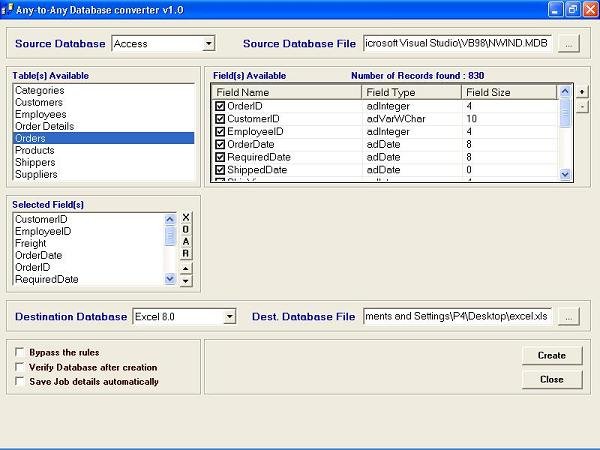



## Any\-to\-Any Database Converter v1\.0

### Description

Using ADO & ADOX, convert between various

database formats like Text, Access, Excel,

dBASE, Paradox & HTML. This is a NEW VERSION of Any-to-Any Database converter. Please follow the link if you like to vote me / to get the original version http://www.planet-source-code.com/vb/scripts/ShowCode.asp?txtCodeId=47434&lngWId=1
 
### More Info
 

             |
---                |---
**Submitted On**   |2003-08-10 02:25:00
**By**             |[Vengadesh\.R](https://github.com/Planet-Source-Code/PSCIndex/blob/master/ByAuthor/vengadesh-r.md)
**Level**          |Beginner
**User Rating**    |4.9 (118 globes from 24 users)
**Compatibility**  |VB 6\.0
**Category**       |[Databases/ Data Access/ DAO/ ADO](https://github.com/Planet-Source-Code/PSCIndex/blob/master/ByCategory/databases-data-access-dao-ado__1-6.md)
**World**          |[Visual Basic](https://github.com/Planet-Source-Code/PSCIndex/blob/master/ByWorld/visual-basic.md)
**Archive File**   |[Any\-to\-Any1628018112003\.zip](https://github.com/Planet-Source-Code/vengadesh-r-any-to-any-database-converter-v1-0__1-47621/archive/master.zip)

